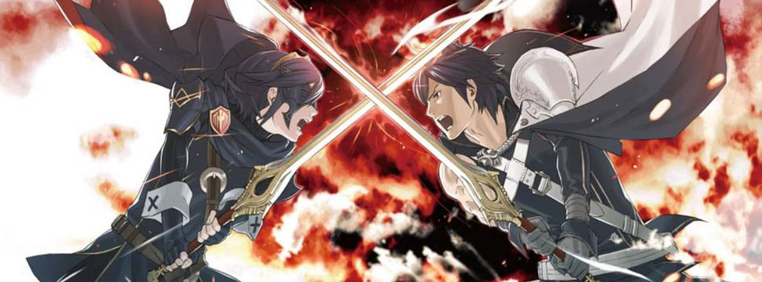

# RPG Orientado a Objeto

## Projeto utilizando os princípios de orientação a objeto

* Herança : Onde os tipos de personagens herdam o atributo da classe pai (Hero) ou no caso dos vilões que herdam outra classe (Monster).
* Abstração : Onde é feito a abstração do que for em comun entre os herois e monstros.
* Encapsulamento: Foi utilizado o construtor para encapsular alguns parametros.
* Polimorfismos: Serve para alterar entre os modos de ataques.

## Linguagens utilizadas 

 

## Desafios

          

* Troquei os heróis utilizados na aula do @felipeAguiar, pelos heróis de um jogo RPG existente (FireEmblem), assim como não somente adicionando os heróis como também vilões.

#### Heróis

          
          
          
          
          
          

          
#### Vilões

          
          
          
                    

